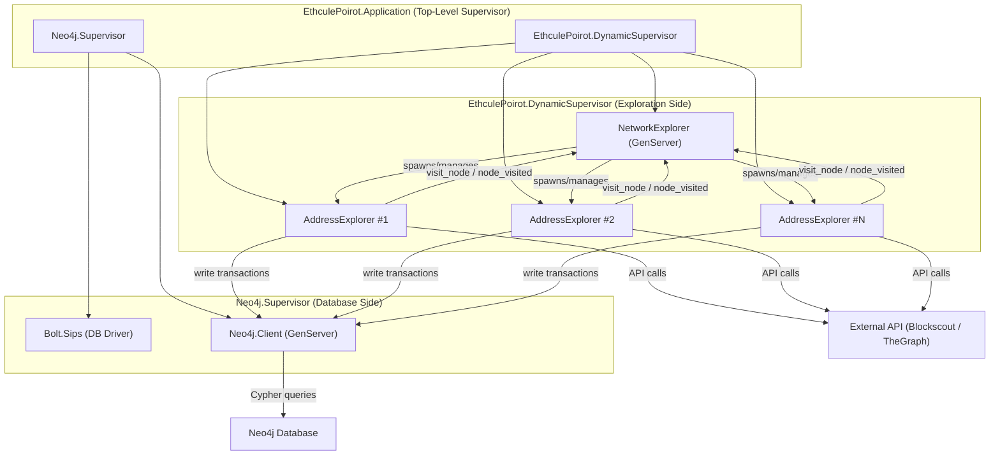
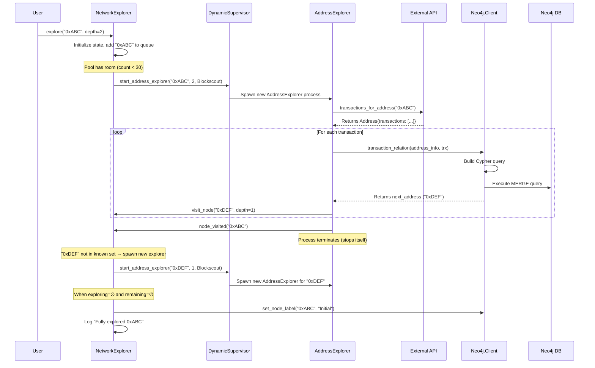

# Ethcule Poirot — Complete Architecture Deep-Dive

> **What is it?** Ethcule Poirot (a pun on "Hercule Poirot" the detective + "Eth" for Ethereum) is a blockchain investigation tool. You give it an Ethereum wallet address, and it recursively crawls through that wallet's transactions, discovers connected wallets, and stores the entire network as a **graph** in a Neo4j database. Then you can query that graph to find suspicious patterns — cycles, shortest paths between wallets, etc.

---

## Elixir/OTP Concepts You Need to Know First

Since you don't know Elixir, here are the key concepts used heavily in this project:

| Concept | What it means (Python/general equivalent) |
|---|---|
| **Module** | Like a Python class, but with no mutable state. It's a namespace that groups functions together. |
| **GenServer** | A long-running background process (like a Python thread) that holds state in memory and responds to messages. Think of it as an object that lives in the background and you communicate with it via messages. |
| **Supervisor** | A process whose only job is to monitor other processes and restart them if they crash. Like a watchdog. |
| **DynamicSupervisor** | A Supervisor that can start/stop child processes at runtime (not just at startup). |
| **`send(pid, message)`** | Sends an asynchronous message to a process — fire and forget, doesn't wait for a response. |
| **`GenServer.call(pid, message)`** | Sends a synchronous message — blocks until the target process replies. |
| **`handle_info/2`** | A callback in a GenServer that handles async messages received via `send()`. |
| **`handle_call/3`** | A callback that handles sync messages received via `GenServer.call()` and sends a reply. |
| **`defstruct`** | Defines a data structure (like a Python `dataclass` or `namedtuple`). |
| **`@behaviour`** | Defines an interface (like a Python ABC/abstract class). Any module implementing it must provide all listed functions. |
| **MapSet** | An unordered collection of unique values (like Python's `set()`). |
| **Pipe operator `\|>`** | Passes the result of the left expression as the first argument to the function on the right. `a \|> b() \|> c()` means `c(b(a))`. |

---

## High-Level Architecture



The application has **two major subsystems** that run in parallel:

1. **Database Side** — manages the connection to Neo4j and writes data
2. **Exploration Side** — crawls Ethereum addresses, fetches transactions from APIs, and coordinates the traversal

---

## Component-by-Component Breakdown

---

### 1. Data Structures

#### [`Address`](file:///Users/sakshammittal/Desktop/Cheating/ethcule-poirot/lib/address.ex) — The Wallet/Contract Representation

```
Fields:
  ├── eth_address  → "0xABC..."  (the Ethereum address string)
  ├── contract     → true/false  (is this a smart contract or a regular wallet?)
  └── transactions → [Transaction, Transaction, ...]  (list of transactions)
```

**In Python terms**, this is like:
```python
@dataclass
class Address:
    eth_address: str | None
    contract: bool | None
    transactions: list[Transaction] | None
```

#### [`Transaction`](file:///Users/sakshammittal/Desktop/Cheating/ethcule-poirot/lib/transaction.ex) — A Single Ethereum Transaction

```
Fields:
  ├── hash         → "0xDEF..."  (unique transaction ID on the blockchain)
  ├── to_address   → "0x123..."  (who received the ETH)
  ├── from_address → "0x456..."  (who sent the ETH)
  ├── value        → "1.5"       (amount of ETH transferred, as a string)
  └── status       → "OK"        (whether the transaction succeeded)
```

All five fields are **required** — you can't create a Transaction without all of them.

---

### 2. Application Entry Point

#### [`EthculePoirot.Application`](file:///Users/sakshammittal/Desktop/Cheating/ethcule-poirot/lib/ethcule_poirot/application.ex) — The Boot Sequence

This is the **main entry point** — it runs when you start the application. It starts **two children**:

```
EthculePoirot.Application starts:
  ├── Neo4j.Supervisor      → manages the database connection + client
  └── EthculePoirot.DynamicSupervisor → manages exploration processes
```

**Strategy: `one_for_one`** — if one child crashes, only that one is restarted (the other keeps running).

**In Python terms:** Think of this as your `if __name__ == "__main__"` block that starts two background thread managers.

---

### 3. Database Side

#### [`Neo4j.Supervisor`](file:///Users/sakshammittal/Desktop/Cheating/ethcule-poirot/lib/neo4j/supervisor.ex) — Database Watchdog

Starts and supervises two processes:

| Child | What it does |
|---|---|
| `Bolt.Sips` | The Neo4j database **driver** (3rd-party library). Opens and maintains the actual TCP connection to Neo4j. Reads connection settings (URL, username, password) from the config file. |
| `Neo4j.Client` | The application's own **database client GenServer** — provides a clean API for the rest of the application to write data to Neo4j. |

#### [`Neo4j.Client`](file:///Users/sakshammittal/Desktop/Cheating/ethcule-poirot/lib/neo4j/client.ex) — The Database Gatekeeper

This is a **GenServer** (a long-running process) that holds the Neo4j connection in its state and provides the following operations:

| Function | Async/Sync | What it does |
|---|---|---|
| `clear_database()` | Async (`send`) | Deletes ALL nodes and relationships from Neo4j — a full reset. |
| `create_indexes()` | Async (`send`) | Creates database indexes on `Account.eth_address`, `SmartContract.eth_address`, and `TO.hash` for fast lookups. |
| `set_node_label(address, label)` | Async (`send`) | Finds a node by its `eth_address` and adds a label like `"Account"`, `"SmartContract"`, or `"Initial"`. |
| `highlight_accounts_of_interest(addresses)` | Async (`send`) | Tags a list of addresses with an `"Interest"` label for visualization. |
| `transaction_relation(address_info, transaction)` | **Sync** (`call`) | The **most important** function. Creates/updates nodes and a `:TO` relationship in Neo4j representing a transaction. **Returns** the "other" address (the counterparty) so the explorer knows what to crawl next. |

**How `transaction_relation` works step by step:**

1. Receives an `Address` struct (the address being explored) and a `Transaction` struct
2. Determines the **counterparty**: if the `to_address` equals the current address, the counterparty is `from_address`, and vice versa
3. Calls [`EnsHelpers.check_for_ens`](file:///Users/sakshammittal/Desktop/Cheating/ethcule-poirot/lib/ens_helpers.ex) to look up human-readable ENS names (like `"vitalik.eth"`) for both addresses
4. Builds a **Cypher query** that:
   - `MERGE`s the current address node (creates it if it doesn't exist)
   - Sets the node label (`Account` or `SmartContract`)
   - `MERGE`s the `to` and `from` nodes
   - Sets ENS names on those nodes
   - Creates a `:TO` relationship between `from → to` with the transaction hash, ETH value, and status
5. Executes the query against Neo4j
6. **Returns the counterparty address** (so the crawler can explore it next)

> [!IMPORTANT]
> `transaction_relation` is the **only synchronous** (blocking) call in the system. Everything else is fire-and-forget. This is because the explorer needs the return value (the next address to explore) before continuing.

#### [`Neo4j.Cypher`](file:///Users/sakshammittal/Desktop/Cheating/ethcule-poirot/lib/neo4j/chyper.ex) — Template Engine for Database Queries

A tiny utility module with one function: `prepared_statement(query_string, variables)`.

**What it does:** Takes a query string with `{{placeholders}}` and replaces them with actual values, escaping single quotes to prevent injection.

**Example:**
```
Input:  "MATCH (n {eth_address: '{{address}}'})"  +  [address: "0xABC"]
Output: "MATCH (n {eth_address: '0xABC'})"
```

**In Python terms:** It's essentially `query.replace("{{key}}", value)` for each key-value pair, with basic SQL-injection protection.

---

### 4. Exploration Side

This is the core "detective" logic — the BFS/graph traversal of the Ethereum network.

#### [`EthculePoirot.DynamicSupervisor`](file:///Users/sakshammittal/Desktop/Cheating/ethcule-poirot/lib/ethcule_poirot/dynamic_supervisor.ex) — The Exploration Process Manager

This supervisor can **dynamically create and destroy child processes** at runtime. On startup it:

1. Initializes itself
2. Immediately starts a `NetworkExplorer` GenServer as its first child

Later, when exploration begins, it dynamically starts `AddressExplorer` processes (one per address being explored).

**Key function:**
- `start_address_explorer(eth_address, depth, api_handler)` — spawns a new `AddressExplorer` child process with the given parameters.

#### [`EthculePoirot.NetworkExplorer`](file:///Users/sakshammittal/Desktop/Cheating/ethcule-poirot/lib/ethcule_poirot/network_explorer.ex) — The Brain / Coordinator

This is the **central coordinator** of the entire exploration. It's a GenServer that:

- Keeps track of **which addresses have been explored** (to avoid re-exploring)
- Keeps track of **which addresses are currently being explored**
- Maintains a **queue** of addresses waiting to be explored
- Enforces a **pool size limit** (default: 30 concurrent explorers) to avoid overwhelming the API

**State it maintains:**

```
%{
  eth_address:     "0x...",        # The initial address that started the exploration
  depth:           3,              # How deep to explore
  known:           MapSet<String>, # ALL addresses ever seen (explored or queued) — like a Python set()
  exploring:       MapSet<String>, # Addresses currently being explored right now
  remaining:       [{addr, depth}], # Queue of addresses waiting for an available slot
  api_adapter:     Adapters.Api.Blockscout, # Which API to use
  processes_count: 5               # How many explorer processes are running right now
}
```

**The exploration flow (step by step):**



**Detailed message handling:**

1. **`{:start, address, depth, api_adapter}`** — Triggered when you call `explore()`. Resets the state completely, sets up the `known` set and `exploring` set as empty, and sends itself an `{:add_to_queue, address, depth}` message.

2. **`{:add_to_queue, address, depth}`** — Triggered when a new address is discovered:
   - If the address is **already in `known`** → skip it (already explored or queued)
   - If the address is **new** and the pool has room (`processes_count < pool_size`) → spawn a new `AddressExplorer` immediately
   - If the address is **new** but the pool is full → add it to the `remaining` queue (it'll be started when a slot opens up)

3. **`{:remove_from_queue, address}`** — Triggered when an `AddressExplorer` finishes:
   - Removes the address from the `exploring` set
   - If there are addresses waiting in `remaining` → pop one off and start exploring it
   - If both `exploring` and `remaining` are empty → **exploration is complete!** Label the initial address as `"Initial"` and log a completion message
   - Otherwise, just decrement the process count

#### [`EthculePoirot.AddressExplorer`](file:///Users/sakshammittal/Desktop/Cheating/ethcule-poirot/lib/ethcule_poirot/address_explorer.ex) — The Worker / Individual Investigator

Each `AddressExplorer` is a **short-lived GenServer** that explores exactly **one address** and then terminates. It's configured with `restart: :transient`, meaning the supervisor won't restart it after it finishes successfully (it's meant to stop).

**Two scenarios based on depth:**

**Scenario A: `depth = 0` (leaf node — don't go deeper)**
1. Calls `api_handler.address_information(address)` to check if it's a smart contract or a regular account
2. Sets the appropriate label in Neo4j (`"SmartContract"` or `"Account"`)
3. Notifies `NetworkExplorer.node_visited(address)` that it's done
4. Stops itself

**Scenario B: `depth > 0` (explore transactions)**
1. Calls `api_handler.transactions_for_address(address)` — this hits the external API
2. The API returns an `Address` struct with a list of transactions
3. For **each transaction**:
   - Calls `Neo4j.Client.transaction_relation(address_info, trx)` to write the transaction to the database
   - Gets back the `next_address` (the counterparty in the transaction)
   - Calls `NetworkExplorer.visit_node(next_address, depth - 1)` to queue it for exploration
4. Notifies `NetworkExplorer.node_visited(address)` that it's done
5. Stops itself

**If there are no transactions** (empty wallet), it just sets the node label and exits.

---

### 5. API Adapter Layer

#### [`Behaviours.Api`](file:///Users/sakshammittal/Desktop/Cheating/ethcule-poirot/lib/behaviours/api.ex) — The Interface Contract

This defines the **interface** that all API adapters must implement:

| Function | What it must do |
|---|---|
| `initial_setup()` | One-time setup (configure API URLs, timeouts, etc.) |
| `transactions_for_address(address)` | Fetch all transactions for a given address. Return an `Address` struct with populated `transactions` list. |
| `address_information(address)` | Fetch metadata about an address (mainly: is it a smart contract?). Return an `Address` struct. |

**In Python terms:** This is like an abstract base class:
```python
class ApiAdapter(ABC):
    @abstractmethod
    def initial_setup(self): ...
    @abstractmethod
    def transactions_for_address(self, address: str) -> Address: ...
    @abstractmethod
    def address_information(self, address: str) -> Address: ...
```

#### [`Adapters.Api.Blockscout`](file:///Users/sakshammittal/Desktop/Cheating/ethcule-poirot/lib/adapters/api/blockscout.ex) — Ethereum Mainnet Transaction Adapter

Uses the **Blockscout GraphQL API** to fetch real Ethereum blockchain transactions.

**`initial_setup()`:** Configures the Neuron GraphQL client with the Blockscout API URL and a 120-second timeout.

**`transactions_for_address(address)`:**
1. Sends a GraphQL query to Blockscout requesting the last 23 transactions for the address (23 is the max allowed by Blockscout's query complexity limits)
2. Also fetches `contractCode` to determine if the address is a smart contract
3. Parses the response: converts each transaction edge into a `Transaction` struct, converting values from **Wei to ETH** (dividing by 10^18)
4. Returns an `Address` struct with `eth_address`, `contract` flag, and the list of `Transaction` structs
5. If the API call fails → logs a warning and returns an empty transactions list (graceful degradation)

**`address_information(address)`:**
1. Queries just the `contractCode` field for the address
2. Returns whether the address is a smart contract (if `contractCode` is non-null, it's a contract)

#### [`Adapters.Api.DissrupTheGraph`](file:///Users/sakshammittal/Desktop/Cheating/ethcule-poirot/lib/adapters/api/dissrup_the_graph.ex) — NFT Marketplace Adapter

Uses **The Graph's subgraph API** to fetch NFT sale data from the Dissrup marketplace. This is a proof-of-concept showing the system works with more than just basic Ethereum transactions.

**`transactions_for_address(address)`:**
1. Queries both `sales` (where the address sold an NFT) and `buys` (where the address bought an NFT)
2. For sales: `from_address = the explored address`, `to_address = the buyer`
3. For buys: `to_address = the explored address`, `from_address = the seller`
4. Combines both lists into `Transaction` structs
5. All statuses are hardcoded to `"OK"` since subgraph data is already confirmed

---

### 6. Helper Module

#### [`EnsHelpers`](file:///Users/sakshammittal/Desktop/Cheating/ethcule-poirot/lib/ens_helpers.ex) — Ethereum Name Service Lookup

ENS is like DNS for Ethereum — it maps human-readable names like `"vitalik.eth"` to hex addresses like `"0xd8da..."`.

**`check_for_ens(to_address, from_address)`:**
1. Sends a GraphQL query to **The Graph's ENS subgraph** asking for domain names associated with both the `to` and `from` addresses
2. Parses the response to extract the first ENS name found for each address
3. Returns `%{to_ens: "name.eth", from_ens: "other.eth"}` (or empty strings if no ENS name exists)
4. If the API call fails → returns empty strings for both (graceful degradation)

This is called by `Neo4j.Client.transaction_relation()` so that every node in the graph database also stores its human-readable ENS name when available.

---

### 7. Configuration

#### [`config/config.exs`](file:///Users/sakshammittal/Desktop/Cheating/ethcule-poirot/config/config.exs)

| Config key | Value | Purpose |
|---|---|---|
| `bolt_sips → url` | `$DATABASE_URL` env var | Neo4j connection URL |
| `bolt_sips → ssl` | `verify: :verify_none` | SSL config for Neo4j cloud connections |
| `bolt_sips → basic_auth` | `$NEO4J_USER` / `$NEO4J_PASSWORD` | Neo4j credentials |
| `bolt_sips → pool_size` | `200` | Max concurrent Neo4j connections |
| `ethcule_poirot → default_api_adapter` | `Adapters.Api.Blockscout` | Which API to use by default |
| `ethcule_poirot → pool_size` | `30` | Max concurrent address explorers |
| `Blockscout → api_url` | `$BLOCKSCOUT_API_URL` env var | Blockscout API endpoint |
| `Blockscout → api_timeout` | `120,000ms` (2 min) | How long to wait for API responses |

---

## The Complete Exploration Flow — End to End

Here's what happens when you run `EthculePoirot.NetworkExplorer.explore("0xABC", 2)`:

### Step 1: Initialization
- `NetworkExplorer` receives the `:start` message
- Calls `Blockscout.initial_setup()` to configure the GraphQL client
- Creates fresh state: empty `known` set, empty `exploring` set, empty `remaining` queue
- Sends itself `{:add_to_queue, "0xabc", 2}`

### Step 2: First Address Exploration
- `"0xabc"` is not in `known` → add it
- Pool count (0) < pool_size (30) → spawn an `AddressExplorer` immediately
- `DynamicSupervisor.start_address_explorer("0xabc", 2, Blockscout)` creates a new process
- The `AddressExplorer` calls `Blockscout.transactions_for_address("0xabc")`
- Blockscout returns 23 transactions

### Step 3: Processing Each Transaction
For each of the 23 transactions:
- `AddressExplorer` calls `Neo4j.Client.transaction_relation(address_info, trx)` (synchronous)
- `Neo4j.Client` looks up ENS names for both addresses
- `Neo4j.Client` builds and executes a Cypher MERGE query, creating nodes and a `:TO` relationship
- `Neo4j.Client` returns the counterparty address (e.g., `"0xDEF"`)
- `AddressExplorer` calls `NetworkExplorer.visit_node("0xDEF", 1)` to queue it

### Step 4: Queue Management
- For each `visit_node` call, `NetworkExplorer` checks:
  - Already in `known`? → Skip
  - New + pool has room? → Spawn immediately
  - New + pool full? → Add to `remaining` queue

### Step 5: First Explorer Finishes
- `AddressExplorer` for `"0xabc"` calls `NetworkExplorer.node_visited("0xabc")`
- `NetworkExplorer` removes `"0xabc"` from `exploring`
- If there are addresses in `remaining` → pop one and start exploring it
- Process count stays the same (one finished, one started)

### Step 6: Depth-1 Exploration
- Each depth-1 explorer fetches transactions, but queues new addresses with `depth - 1 = 0`

### Step 7: Depth-0 (Leaf Nodes)
- Depth-0 explorers **don't fetch transactions** — they only check if the address is a smart contract, label the node, and exit

### Step 8: Completion
- Eventually, `exploring` is empty and `remaining` is empty
- `NetworkExplorer` labels the initial address `"0xabc"` with the `"Initial"` label
- Logs `"Fully explored 0xabc"`

---

## The Neo4j Graph Structure

After exploration, the database contains:

```
Nodes:
  ├── (:Account {eth_address: "0x...", ens_name: "name.eth"})
  ├── (:SmartContract {eth_address: "0x...", ens_name: ""})
  └── (:Initial {eth_address: "0x..."})   ← the starting address

Relationships:
  └── (:Account)-[:TO {hash: "0x...", eth_value: "1.5", status: "OK"}]->(:Account)
```

You can then run Cypher queries to detect:
- **Cycles** (money going in circles — potential money laundering)
- **Shortest paths** between two wallets
- **High-value transaction chains**

---

## Summary: How Components Interact

```
┌─────────────────────────────────────────────────────────────┐
│                    USER                                      │
│  explore("0xABC", 2) ──────────────────────────────────────┐│
└─────────────────────────────────────────────────────────────┘│
                                                               │
┌──────────────────────────────────────────────────────────────▼─┐
│                  NetworkExplorer (Coordinator)                  │
│  • Tracks known/exploring/remaining                            │
│  • Enforces pool_size=30 concurrency limit                     │
│  • Spawns AddressExplorers via DynamicSupervisor               │
│  • Detects completion (exploring=∅, remaining=∅)               │
├────────────────────────────────┬────────────────────────────────┤
│         spawns ↓               │             ↑ visit_node()    │
│                                │             ↑ node_visited()  │
├────────────────────────────────▼────────────────────────────────┤
│              AddressExplorer (Worker, 1 per address)           │
│  • Calls API adapter to fetch transactions                     │
│  • For each txn → writes to Neo4j via Neo4j.Client             │
│  • Queues newly discovered addresses back to NetworkExplorer   │
│  • Self-terminates when done                                   │
├────────────────────────────────┬────────────────────────────────┤
│    uses ↓                      │    uses ↓                      │
├────────────────────────────────▼──┬─────────────────────────────▼─┐
│  API Adapter (Blockscout/Graph)   │    Neo4j.Client (DB Writer)    │
│  • Fetches txns via GraphQL       │    • MERGE nodes + relationships│
│  • Returns Address structs        │    • Uses Cypher prepared stmts │
│  • Converts Wei → ETH             │    • Looks up ENS names         │
└───────────────────────────────────┴────────────────────────────────┘
```
